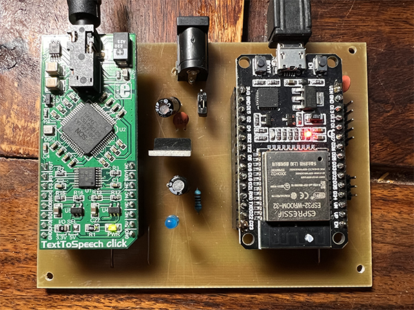
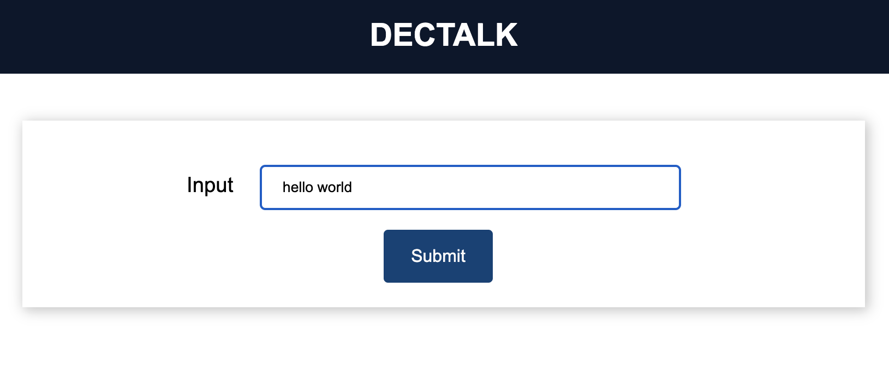
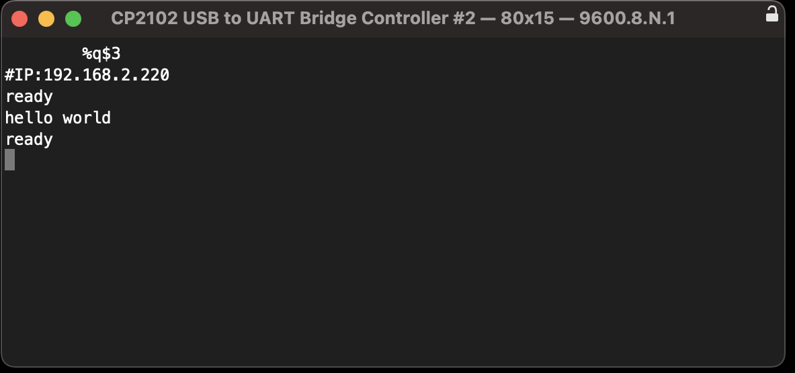

# DECTALK 

DECTALK is a simple application of Epson's S1V30120 chip. The communication is controlled by the ESP32 module. Esp32 provides HTTP and serial access for control. MIKROE produces a suitable module carrying the S1V30120 and an amplifier. 

The hardware directory contains a schematic and a board of plenum connections in KICAD format.
The src directory contains the source code for ESP32.

# How to use it 

The module can communicate using HTTP protocol via WiFi or using a serial link.

WiFi connection:
	- on first run, create an AP named `DECTALK CONFIG` or press reset (EN) twice within 5 seconds. 
	- web browser http://192.168.4.100 and fill in the web form

 	POST via build in fomular:  http://192.168.2.220/talk
 	POST via build in fomular:  http://192.168.2.220
	GET with url encoded string as param:   http://XXX.XXX.XXX.XXX/talk?talk=hello%20world

Serial line connection:
	- 9600.8.N.1 

LED status on the ESP32 module:
 - fast LED blinking - error, more detail after serial line
 - slow blinking LED - runs as AP `DECTALK CONFIG`
 - turns on and then off - when playing a message

# Device limitations

The message length is limited to 248 characters.

# Documentation 

S1V30120 module:  https://www.mikroe.com/text-to-speech-click.

S1V30120 initialization data: https://global.epson.com/products_and_drivers/semicon/products/speech/voice/sla/s1v30120_init_data.html

S1V30120 protocol: https://global.epson.com/products_and_drivers/semicon/pdf/id001875.pdf

# Screens

	
